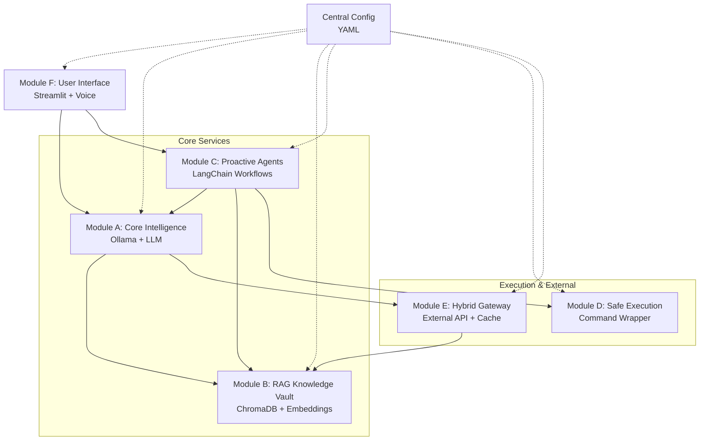

# Design Document

## Overview

The Linux Superhelfer is designed as a microservices architecture with 6 independent modules communicating through standardized REST APIs. Each module runs as a separate Python service with FastAPI, enabling independent development, deployment, and scaling. The system prioritizes local execution using Ollama for AI inference while providing hybrid capabilities through external API integration.

## Architecture

### High-Level Architecture



### Service Communication Pattern

All modules expose standardized REST APIs:
- **Health Check**: `GET /health` → `{"status": "ok"}`
- **Main Endpoint**: `POST /main` → Standard JSON I/O
- **Module-Specific**: Additional endpoints per module requirements

### Port Allocation
- Module A (Core): 8001
- Module B (RAG): 8002  
- Module C (Agents): 8003
- Module D (Execution): 8004
- Module E (Hybrid): 8005
- Module F (UI): 8000 (main entry point)

## Components and Interfaces

### Module A: Core Intelligence Engine

**Technology Stack**: FastAPI, Ollama Python Client, Pydantic

**Core Components**:
- `OllamaClient`: Manages connection to Ollama server
- `QueryProcessor`: Handles input validation and preprocessing
- `ConfidenceCalculator`: Evaluates response quality using heuristics
- `ResponseFormatter`: Standardizes output format
- `ModelRouter`: Intelligent model selection based on query analysis
- `VRAMMonitor`: Real-time VRAM usage monitoring with pynvml
- `QueryAnalyzer`: Detects Linux/code-related queries using tiktoken and keywords

**API Endpoints**:
```python
POST /infer
{
    "query": "string",
    "context": "optional string"
}
→
{
    "response": "string",
    "confidence": 0.0-1.0,
    "processing_time": "float"
}
```

**Confidence Calculation Logic**:
- Response length analysis (too short = low confidence)
- Uncertainty keywords detection ("maybe", "not sure")
- Model perplexity if available
- Threshold: < 0.5 triggers escalation
- VRAM usage monitoring for model switching decisions

**Intelligent Model Routing**:
- **Fast Model**: Llama 3.2 11B Vision (7.9GB) for general queries, quick responses
- **Code Model**: Qwen3-Coder-30B Q4 (18-22GB) for Linux commands, shell scripts, system administration
- **Heavy Model**: Llama 3.1 70B (fallback for extreme complexity)
- **VRAM Monitoring**: pynvml integration with >80% usage warnings
- **Smart Switching**: Automatic model selection based on query analysis

### Module B: RAG Knowledge Vault

**Technology Stack**: FastAPI, ChromaDB, LangChain, nomic-embed-text

**Core Components**:
- `DocumentLoader`: Handles PDF/TXT file processing
- `ChunkProcessor`: Splits documents into 500-token segments
- `EmbeddingManager`: Interfaces with Ollama embeddings
- `VectorStore`: ChromaDB persistence layer
- `Retriever`: Semantic search with similarity threshold

**API Endpoints**:
```python
POST /upload
{
    "files": ["base64_encoded_content"],
    "metadata": {"source": "string", "type": "string"}
}

POST /search
{
    "query": "string",
    "top_k": 3,
    "threshold": 0.6
}
→
{
    "snippets": [
        {
            "content": "string",
            "source": "string",
            "score": "float"
        }
    ]
}
```

**Storage Structure**:
```
data/
├── chromadb/          # Vector database
├── uploads/           # Original files
└── processed/         # Chunked documents
```

### Module C: Proactive Agents

**Technology Stack**: FastAPI, LangChain, Custom Agent Framework

**Core Components**:
- `TaskClassifier`: Identifies task types from user input
- `AgentOrchestrator`: Manages workflow execution
- `SessionManager`: Maintains conversation state
- `TaskExecutors`: Specialized handlers for different task types

**Predefined Tasks**:
1. **Log Analysis**: Parse system logs, identify issues
2. **Backup Creation**: Generate backup scripts
3. **System Monitoring**: Check system health

**API Endpoints**:
```python
POST /execute_task
{
    "task_type": "log_analyze|backup_create|system_monitor",
    "params": {"key": "value"},
    "session_id": "optional string"
}
→
{
    "result": "string",
    "actions_required": ["string"],
    "confirmation_needed": "boolean"
}
```

**Workflow Pattern**:
1. Classify task type
2. Gather context from Core (A) and RAG (B)
3. Generate action plan
4. Request human confirmation if needed
5. Execute via Safe Execution (D)

### Module D: Safe Execution & Control

**Technology Stack**: FastAPI, subprocess, shlex

**Core Components**:
- `CommandParser`: Analyzes command structure and safety
- `DryRunSimulator`: Predicts command effects without execution
- `ExecutionLogger`: Audit trail for all commands
- `SafetyChecker`: Validates commands against blacklist/whitelist

**API Endpoints**:
```python
POST /safe_execute
{
    "command": "string",
    "dry_run": "boolean",
    "force": "boolean"
}
→
{
    "preview": "string",
    "executed": "boolean",
    "output": "string",
    "exit_code": "integer"
}
```

**Safety Mechanisms**:
- Command parsing and validation
- Dry-run simulation with predicted effects
- User confirmation requirement
- Execution logging and audit trail
- Rollback suggestions where possible

### Module E: Hybrid Intelligence Gateway

**Technology Stack**: FastAPI, requests, asyncio

**Core Components**:
- `ConfidenceEvaluator`: Receives confidence scores from Core (A)
- `ExternalAPIClient`: Manages Grok API communication
- `CacheManager`: Stores external responses in RAG (B)
- `FallbackHandler`: Manages offline scenarios

**API Endpoints**:
```python
POST /escalate
{
    "query": "string",
    "confidence": "float",
    "context": "optional string"
}
→
{
    "external_response": "string",
    "cached": "boolean",
    "source": "grok|fallback"
}
```

**Escalation Logic**:
1. Receive low-confidence query from Core (A)
2. Check internet connectivity
3. Send to Grok API if online
4. Cache response in RAG (B)
5. Return enhanced response

### Module F: User Interface

**Technology Stack**: Streamlit, Whisper (optional), gTTS (optional)

**Core Components**:
- `ChatInterface`: Main conversation UI
- `VoiceHandler`: STT/TTS integration
- `ModuleOrchestrator`: Routes requests to appropriate modules
- `SessionManager`: Maintains chat history
- `ConfigManager`: Loads module endpoints from YAML

**Interface Flow**:
1. User input (text/voice)
2. Route to Core Intelligence (A)
3. Enhance with RAG if needed (B)
4. Execute tasks via Agents (C)
5. Display results with confirmation options

**Configuration Structure**:
```yaml
modules:
  core: "http://localhost:8001"
  rag: "http://localhost:8002"
  agents: "http://localhost:8003"
  execution: "http://localhost:8004"
  hybrid: "http://localhost:8005"

features:
  voice_enabled: true
  auto_escalation: true
  safe_mode: true
```

## Data Models

### Core Data Types

```python
# Shared models across modules
class Query(BaseModel):
    text: str
    context: Optional[str] = None
    session_id: Optional[str] = None
    timestamp: datetime

class Response(BaseModel):
    content: str
    confidence: float
    source: str
    processing_time: float

class Task(BaseModel):
    type: str
    params: Dict[str, Any]
    status: str
    result: Optional[str] = None

class Command(BaseModel):
    command: str
    safe: bool
    preview: str
    executed: bool
    output: Optional[str] = None
```

### Database Schemas

**ChromaDB Collections**:
- `documents`: Original document chunks with metadata
- `external_cache`: Cached responses from external APIs
- `user_sessions`: Session data and preferences

## Error Handling

### Standardized Error Response
```python
{
    "error": "string",
    "code": "integer",
    "details": "optional string",
    "suggestion": "optional string"
}
```

### Error Categories
- **Connection Errors**: Module unavailable, network issues
- **Processing Errors**: Invalid input, model failures
- **Security Errors**: Unsafe commands, permission issues
- **Resource Errors**: Memory, disk space, rate limits

### Fallback Strategies
- Module failure → Continue with available modules
- External API failure → Use local processing only
- Model failure → Return cached responses or error message

## Testing Strategy

### Unit Testing
- Each module: Independent test suite
- API endpoints: Request/response validation
- Core logic: Business rule verification
- Error handling: Exception scenarios

### Integration Testing
- Module communication: API contract validation
- End-to-end workflows: Complete user scenarios
- Configuration: Different setup combinations
- Performance: Response time and resource usage

### Test Data
- Sample documents for RAG testing
- Mock external API responses
- Safe test commands for execution module
- Various query types for classification

### Testing Tools
- pytest for unit tests
- httpx for API testing
- docker-compose for integration testing
- locust for performance testing

## Security Considerations

### Local-First Security
- No external data transmission by default
- Local file system permissions
- Process isolation between modules
- Audit logging for all operations

### Command Execution Safety
- Whitelist/blacklist for commands
- Dry-run mandatory for destructive operations
- User confirmation for system changes
- Execution logging and rollback guidance

### API Security
- Local network binding only
- Optional API key authentication
- Rate limiting per module
- Input validation and sanitization

This design provides a robust, modular foundation for the Linux Superhelfer while maintaining security, performance, and extensibility requirements.